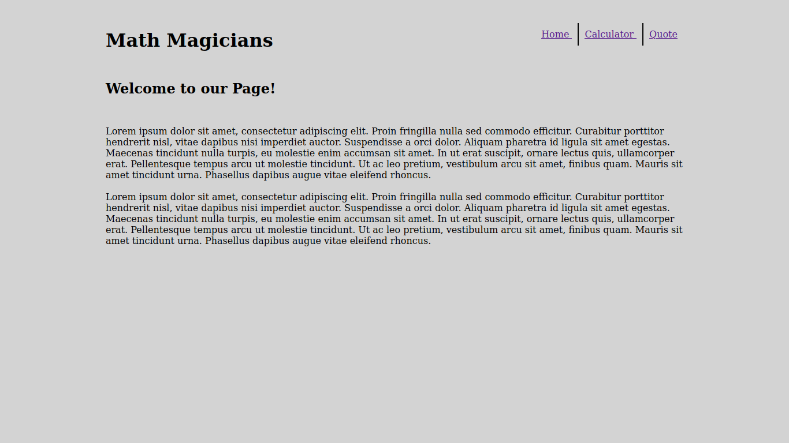

# Calculator

> This is the fourth milestone of the project



> This milestone came with the logic of the calculator

## Built With

- React
- Javascript
- VsCode

## Live Demo

[Live Demo Link](https://reactcalculapp.herokuapp.com/)


## To get this project set up on your local machine, follow these simple steps:

# Step 1
Navigate through the local folder where you want to clone the repository and run
``` 
    git clone https://github.com/tahiry-dev/react-calculator.git 
```

# Step 2
Run ``` cd calculator ```

# Step 3
Run ``` npm install ``` to install the npm packages from the package.json file.

# Step 4
Run ```npm start ``` to start the webpack server, you can now navigate to http://localhost:3000 to view the app. The server refreshes the app every time you make a change to a file used by it.

## Authors

👤 **Tahiry RANDRIAMIARINTSOA**

- GitHub: [@tahiry-dev](https://github.com/tahiry-dev)
- Twitter: [@tahiry](https://twitter.com/Tahiry94825074)
- LinkedIn: [randriamiarintsoa](https://www.linkedin.com/in/tahiry-randriamiarintsoa/)

## 🤝 Contributing

Contributions, issues, and feature requests are welcome!

## Show your support

Give a ⭐️ if you like this project!
fs
## 📝 License

This project is [MIT](lic.url) licensed.
